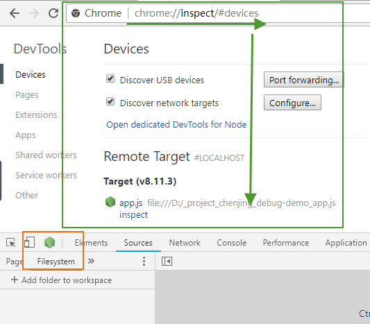
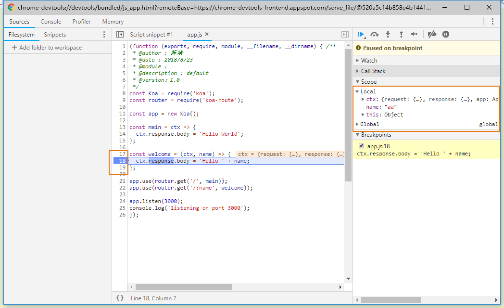

# 调试工具入门

## 1.示例程序

 为了方便讲解，下面是一个示例脚本。首先，新建一个工作目录，并进入该目录。

```text
mkdir debug-demo
cd debug-demo
npm init -y
npm install --save koa koa-route
```

 接着，新建一个脚本`app.js`，并写入下面的内容。

```text
// app.js
const Koa = require('koa');
const router = require('koa-route');

const app = new Koa();

const main = ctx => {
  ctx.response.body = 'Hello World';
};

const welcome = (ctx, name) => {
  ctx.response.body = 'Hello ' + name;
};

app.use(router.get('/', main));
app.use(router.get('/:name', welcome));

app.listen(3000);
console.log('listening on port 3000');
```

## 2.启动开发者工具

现在开始运行脚本

```text
node --inspect app.js
```

 上面代码中，`--inspect`参数是启动调试模式必需的。这时，打开浏览器访问`http://127.0.0.1:3000`，就可以看到 Hello World 了。

 接下来，就要开始调试了。一共有两种打开调试工具的方法，第一种是在 Chrome 浏览器的地址栏，键入 `chrome://inspect`或者`about:inspect`，回车后就可以看到下面的界面。



  
两个颜色的框都可以进入调试面板

## 3.调试工具窗口

 调试工具其实就是"开发者工具"的定制版，省去了那些对服务器脚本没用的部分。

* console 控制台
* memory 内存
* profiler  性能
* source 源码

这里和写js 的差不多 主要讲下source 部分

## 4.设置断点

 这时，浏览器访问 http://127.0.0.1:3000/aa ，页面会显示正在等待服务器返回。切换到调试工具，可以看到 Node 主线程处于暂停（paused）阶段。



再切回 Sources 面板，右侧可以看到 Watch、Call Stack、Scope、Breakpoints 等折叠项。打开 Scope 折叠项，可以看到 Local 作用域和 Global 作用域里面的所有变量。

Local 作用域里面，变量`name`的值是`alice`，双击进入编辑状态，把它改成`bob`。等等操作都可以实现了

## 5.调试非服务脚本

 Web 服务脚本会一直在后台运行，但是大部分脚本只是处理某个任务，运行完就会终止。这时，你可能根本没有时间打开调试工具。等你打开了，脚本早就结束运行了。这时怎么调试呢？

```text
node --inspect=9229 -e "setTimeout(function() { console.log('yes'); }, 30000)"
```

 上面代码中，`--inspect=9229`指定调试端口为 9229，这是调试工具默认的通信端口。`-e`参数指定一个字符串，作为代码运行。

 访问`chrome://inspect`，就可以进入调试工具，调试这段代码了。 代码放在`setTimeout`里面，总是不太方便。那些运行时间较短的脚本，可能根本来不及打开调试工具。这时就要使用下面的方法。

```text
node --inspect-brk=9229 app.js
```

 上面代码中，`--inspect-brk`指定在第一行就设置断点。也就是说，一开始运行，就是暂停的状态。

## 6.忘了写 --inspect 怎么办？

打开调试工具的前提是，启动 Node 脚本时就加上`--inspect`参数。如果忘了这个参数，还能不能调试呢？回答是可以的。首先，正常启动脚本。

```text
node app.js
```

 然后，在另一个命令行窗口，查找上面脚本的进程号。

```text
$ ps ax | grep app.js 

30464 pts/11   Sl+    0:00 node app.js
30541 pts/12   S+     0:00 grep app.js
```

上面命令中，`app.js`的进程号是`30464`。接着，运行下面的命令

```text
node -e 'process._debugProcess(30464)'
```

上面命令会建立进程 30464 与调试工具的连接，然后就可以打开调试工具了。

还有一种方法，就是向脚本进程发送信号，也可以建立调试连接。

```text
kill -SIGUSR1 30464
```

