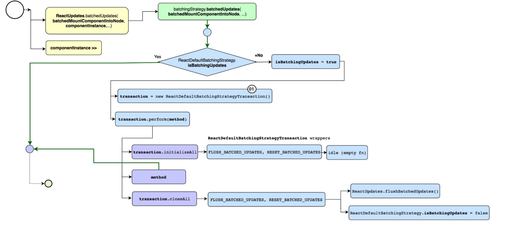

# 请详细描述React和Vue SetState的原理



React调用的方法中连续setState走的是批量更新，此外走的是连续更新。就是说如果方法是通 过React调用的比如生命周期函数，React的事件处理等，那么会进行批量更新，自己调用的方法 比如setTimeout，xhr等则是连续更新。批量更新走的是事物更新batchedUpdates。也就是如下

React调用的方法中连续setState走的是批量更新，此外走的是连续更新。就是说如果方法是通 过React调用的比如生命周期函数，React的事件处理等，那么会进行批量更新，自己调用的方法 比如setTimeout，xhr等则是连续更新。批量更新走的是事物更新batchedUpdates。也就是如下



Vue 的 DOM 更新是异步执行的。理解这一点非常重要。当侦测到数据变化时， Vue 会打开一 个队列，然后把在同一个事件循环 \(event loop\) 当中观察到数据变化的 watcher 推送进这个队列。 假如一个 watcher 在一个事件循环中被触发了多次，它只会被推送到队列中一次。然后，在进入 37 ㊙ 下一次的事件循环时， Vue 会清空队列并进行必要的 DOM 更新。在内部，Vue 会使用 MutationObserver 来实现队列的异步处理，如果不支持则会回退到 setTimeout\(fn, 0\)。

Vue是如何利用事件循环的。需要明白两个东西，microtask与MutationObserver



