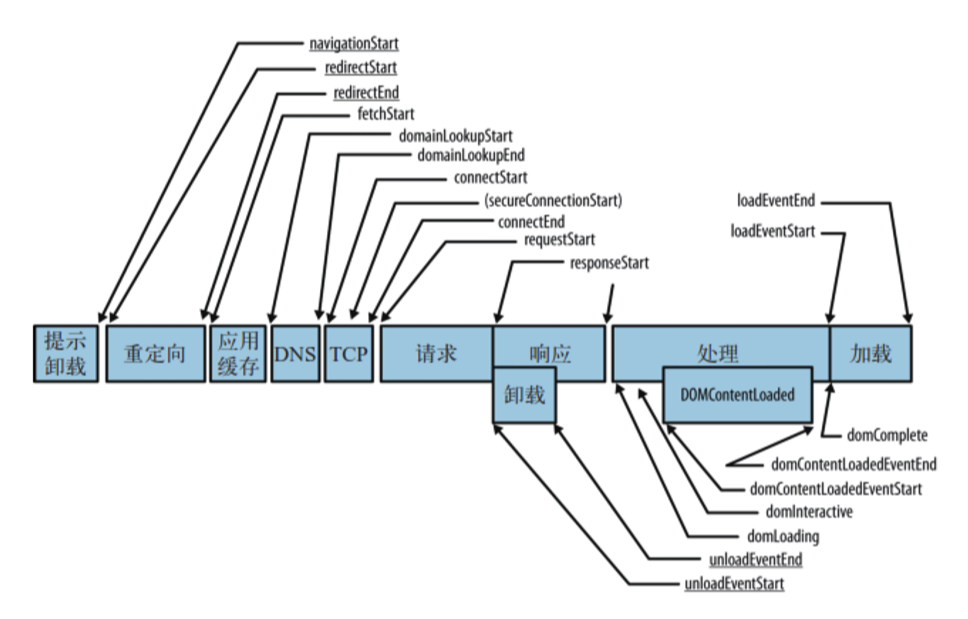

# 如果让你开发一个性能统计平台，请你 写出你的思路

## 对我们比较有用的页面性能数据大概包括如下几个：

**DNS查询耗时、TCP链接耗时、request请求耗时、解析dom树耗时、白屏时间、domready时间、 onload时间等，而这些参数是通过上面的performance.timing各个属性的差值组成的，计算方法 如下：** 

1. DNS查询耗时 ：domainLookupEnd - domainLookupStart 
2. TCP链接耗时 ：connectEnd - connectStart 
3. request请求耗时 ：responseEnd - responseStart 
4. 解析dom树耗时 ： domComplete- domInteractive 
5. 白屏时间 ：responseStart - navigationStart 
6. domready时间 ：domContentLoadedEventEnd - navigationStart 
7. onload时间 ：loadEventEnd - navigationStart 
8. NavigationTiming的目的是用于分析页面整体性能指标。如果要获取个别资源（例如JS、图片） 的性能指标，就需要使用Resource Timing API。

## 打点请求数据 要用navigator.sendBeacon\(“日志请求地址”\)发送，因为它是等主渲染进程不 忙的时候进行发送。做埋点最怕的就是影响主进程。

