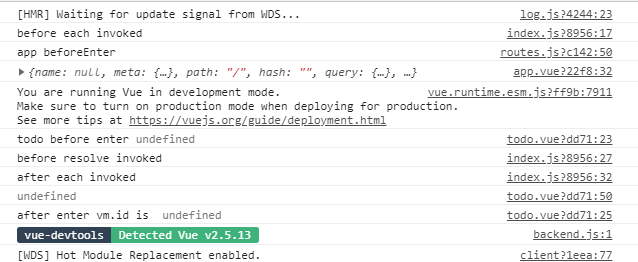
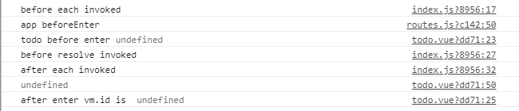

# 导航守卫

## 路由命名空间

#### 此时比如一个路由要渲染多个&lt;route-view&gt;&lt;/route-view&gt;时?

```text
  {
    path: '/login',
    // component: Login
    components:{ //s 不要少写
      default:Login,
      a:Todo
    },
  }
```

```text
<router-view></router-view>
<router-view name="a"></router-view>

```

## 路由守卫

### 全局路由守卫

```text
// 路由守卫

router.beforeEach((to, from, next) => {
  console.log('before each invoked')
  next()
  // if (to.fullPath === '/app') {
  //   next({ path: '/login' })
  // } else {
  //   next()
  // }
})

router.beforeResolve((to, from, next) => {
  console.log('before resolve invoked')
  next()
})

router.afterEach((to, from) => {
  console.log('after each invoked')
})
```

### route路由守卫

```text
 beforeEnter(to,from,next){
      console.log('app beforeEnter ')
      next()
    }
```

### 组件路由守卫

```text
 beforeRouteEnter (to, from, next) {
      // 可以在这里使用数据请求
      console.log('todo before enter', this)
      next(vm => {
        console.log('after enter vm.id is ', vm.id)
      })
    },
    /*在相同路径下面.都是使用同一个组件时 mounted只会执行一次,所以要使用beforeRouteUpdate*/
    beforeRouteUpdate (to, from, next) {
      console.log('todo update enter')
      next()
    },
    beforeRouteLeave (to, from, next) {
      // 离开页面的时候.做判断
      console.log('todo leave enter')
      if(global.confirm('are you sure?')){
        next()
      }

```

### 这三个路由守卫的区别

先看执行结果



第二次更新相同组件

/_**在相同路径下面.都是使用同一个组件时 mounted只会执行一次,所以要使用beforeRouteUpdate**_**/**



从外到里然后在里到外

## 异步路由

**npm i babel-plugin-syntax-dynamic-import -D**

**添加.babelrc  文件 配置**

```text
{
  "presets": [
    "env"
  ],
  "plugins": [
    "transform-vue-jsx",
    "syntax-dynamic-import"
  ]
}
```

use :

```text
component:()=>import('../views/todo/todo.vue')
```

