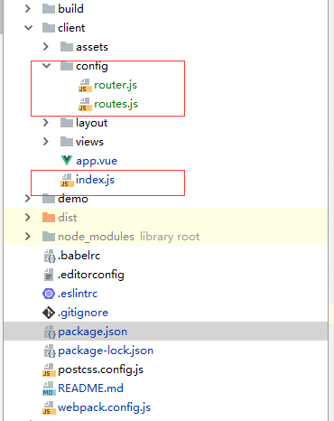

# Vue-router之集成

首先是安装vue-router通过npm安装



```text
//routes.js

import Todo from '../views/todo/todo.vue'
import Login from '../views/login/login.vue'
export default [
  {
    path: '/app',
    component: Todo
  },
  {
    path: '/login',
    component: Login
  }
]

```

```text
//router.js
import Router from 'vue-router'
import routes from './routes'

// const router = new Router({
//   routes
// })
//
// export default router
/* 在服务端渲染的时候,会导致溢出,所有这样导出 */
 export default ()=>{
  return new Router({
    routes
  })
}

```

```text
//main.js  我这里是index.js
import Vue from 'vue'
import VueRouter from 'vue-router'
import App from './app.vue'
import './assets/styles/global.styl'
import createRouter from './config/router'

Vue.use(VueRouter)
/*我这里注释了是因为 webpack那里配置了 html 模板*/
// const root = document.createElement('div')
// document.body.appendChild(root)

const router = createRouter()

new Vue({
  router,
  render: (h) => h(App)
}).$mount('#root')

```

