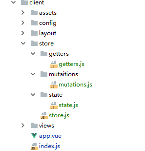

# Getters&State



```javascript
//store.js
import Vuex from 'vuex'

import defaultState from './state/state'
import mutations from  './mutaitions/mutations'
import getters from './getters/getters'
export default ()=>{
  return new Vuex.Store({
    state:defaultState,
    mutations,
    getters
  })
}

```

```javascript
//getters.js

export default {
  fullName(state) {
    return `${state.firstName} * ${state.lastName}`
  }
}

```

```text
//mutations.js

export  default {
  updateCount(state,num){
    state.count=num
  }
}

```

```text
//state.js

export default {
  /*事先要声明好值.不后面知否用到*/
  count:0,
  firstName:'chen',
  lastName:'jing'
}
```

```text
<template>
  <div id="app">
    <p>{{count}}</p>
    <p>{{fullName}}</p>
  </div>
</template>

<script>
  import {mapState, mapGetters} from 'vuex'
  import state from "./store/state/state";

  export default {
    mounted() {
      console.log(this.$route)
      console.log(this.$store)
      let i = 1;
      setInterval(() => {
        this.$store.commit('updateCount', i++)
      }, 1000)
    },
    computed: {
    /*四种方法 拿state******************************************/
      // count() {
      //   return this.$store.state.count
      // },
      ...mapState(['count']),
      ...mapState({
        counter:'count'
      }),
      ...mapState({
        /*这中写法可以计算 看情况来使用*/
        counter:(state)=>state.count
      }),
      
      /*两种方法拿 getter*******************************************/
      // fullName() {
      //   return this.$store.getters.fullName
      // }
      ...mapGetters(['fullName'])
    }
  }
</script>
```

